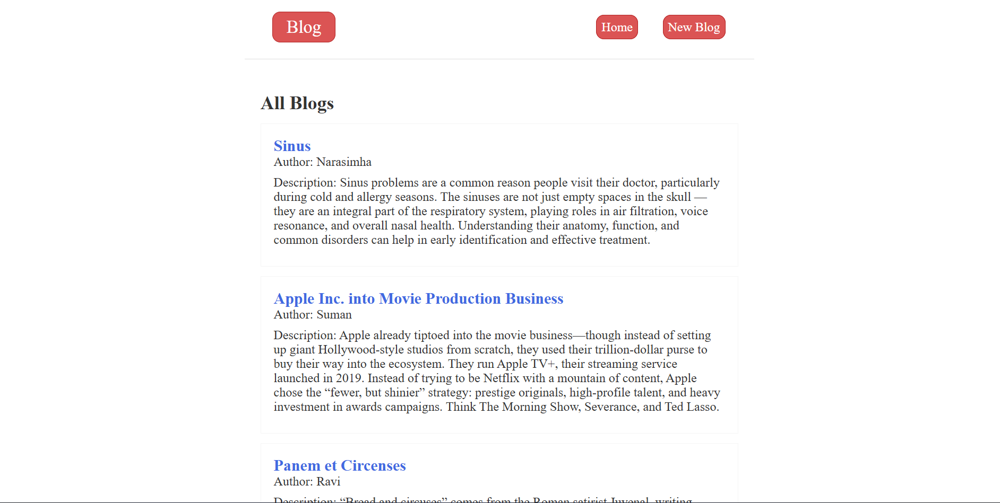
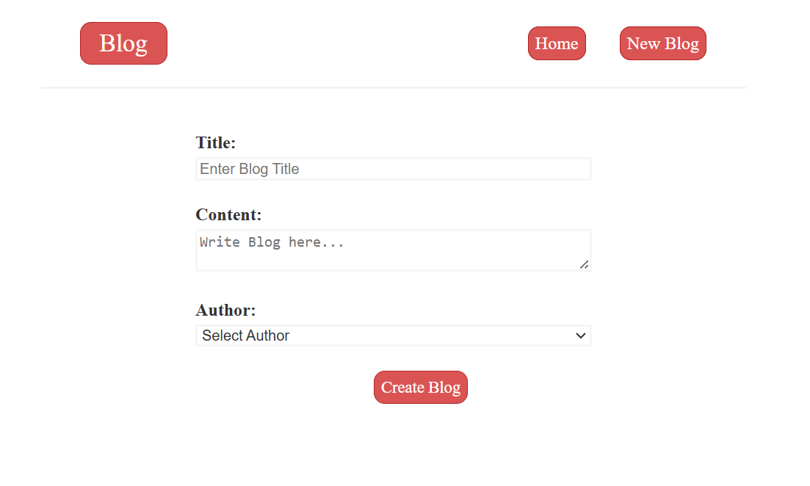
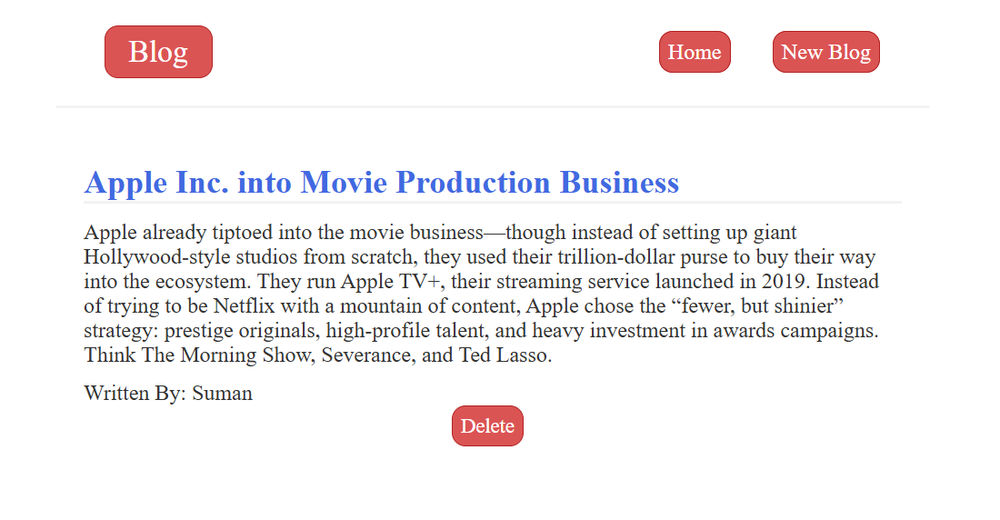

# Blog Application

A simple blog application built with **React**, **Tailwind CSS**, and plain **HTML/CSS/JavaScript**.  
The app uses a local JSON server (`json-server`) to simulate a backend API for posts and data management.

**Features**

- Responsive design with Tailwind CSS
- Dynamic UI built with React
- Local mock API powered by `json-server`
- Create, read, update, and delete (CRUD) blog posts

### Prerequisites

Make sure you have the following installed:

Node.js
Tailwind CSS

### Installation

1. Clone the repository:
   git clone https://github.com/Jithu666/Blog-App.git

   cd blog-application

   npm install

**_Running the Project_**
The app requires two processes:

    One for the mock backend (json-server)

    One for the frontend (React development server)

1. Start the JSON Server
   This command runs the API on port 8080:
   npx json-server --watch data/db.json --port 8080
2. Start the Frontend
   Run the React development server:
   npm run dev

**_Tech Stack_**
Frontend: React, Tailwind CSS, JavaScript, HTML, CSS
Backend: JSON Server
Build Tool: Vite.

All Blogs:

Create Blog:

View Blog:

